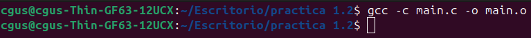
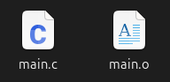
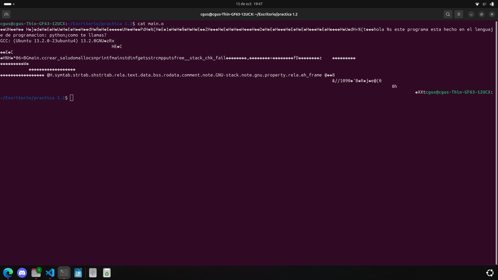
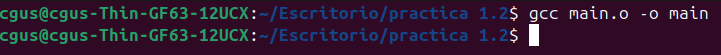
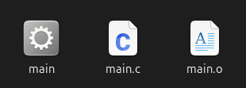
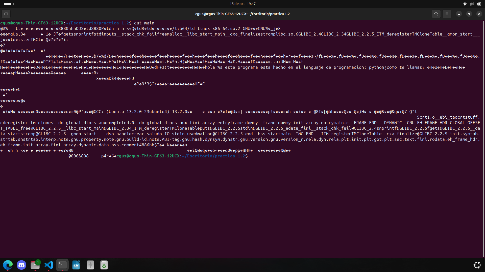
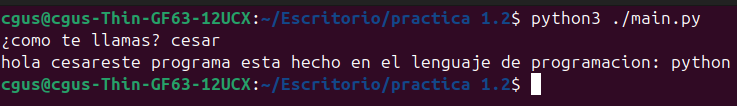
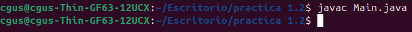
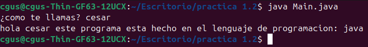
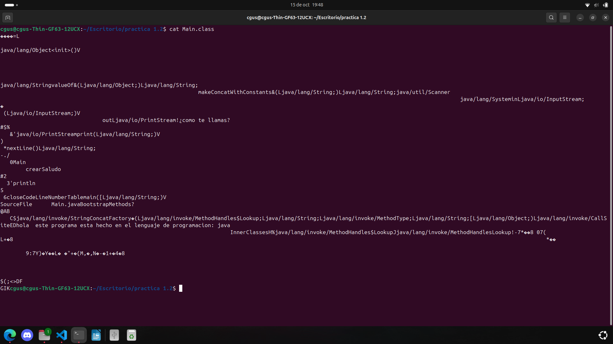

# Práctica 2: Introducción al desarrollo. Ponlo en práctica. 

Apoyate en los siguientes recursos para realizar la práctica:

[Descripción de la práctica](https://revilofe.github.io/section3/u01/practica/EDES-U1.-Practica011/)


---

# Práctica 2: Elementos de desarrollo

## Identificación de la Actividad
- **ID de la Actividad:** P1.2
- **Módulo:**  EDES
- **Unidad de Trabajo:** 1º DAW A
- **Fecha de Creación:**   19/10/2024
- **Fecha de Entrega:** [Fecha de entrega]
- **Alumno(s):** 
  - **Nombre y Apellidos:** Cesar Gabriel Ucha Sousa
  - **Correo electrónico:** cuchsou815@g.educaand.es
  - **Iniciales del Alumno/Grupo:** CGUS

## Descripción de la Actividad
En esta actividad veremos el lenguaje compilado de C, lenguaje en maquina virtual de java y el lenguaje interpretado de python ademas de las diferencias entre estos tres

## Instrucciones de Compilación y Ejecución
1. **Requisitos Previos:**
   - Lenguajes de programacion: Python, C y Javs
   - visual studio code, GCC y JVM

## Desarrollo de la Actividad
### Descripción del Desarrollo
#### Relación entre Software y Hardware
##### Describe cómo el software que has creado se ha relacionado con los componentes físicos del dispositivo (memoria RAM, procesador, periféricos, etc.) durante la ejecución de los tres lenguajes (interpretado, compilado y en máquina virtual).
Al ejecutar el programa entra en juego el sistema operativo que se encarga de la gestión del trabajo del hardware, que trabaja según los impulsos de reloj y las órdenes que recibe del microprocesador. 
Cuando el sistema operativo envía una orden de ejecución al microprocesador este carga la orden en la memoria RAM y esta empieza a ejecutar según orden de procesamiento y gestión de los hilos. El ordenador procesa el código y si está todo correcto, lo ejecuta. En caso contrario lanzará un mensaje de error.
El programa o aplicación a ejecutar debe estar previamente diseñado, codificado, interpretado/compilado, integrado y probado.
#### Diferenciación entre Código Fuente, Código Objeto y Ejecutable
##### Explica cómo el código fuente que escribiste se transformó en código objeto y ejecutable en el caso de los lenguajes compilados. ¿Generaste archivos intermedios (código objeto)? ¿Qué nombres tomaron estos archivos?
creamos el archivo main.c y dentro de él creamos el código fuente
```C
// codigo en C
#include <stdio.h>
#include <stdlib.h>
#include <string.h>

char* crear_saludo(char* nombre) {
    char* saludo = (char*)malloc(100 * sizeof(char));
    snprintf(saludo, 100, "hola %s este programa esta hecho en el lenguaje de programacion: python", nombre);
    return saludo;
}

int main() {
    char nombre[50];
    printf("¿como te llamas? ");
    fgets(nombre, sizeof(nombre), stdin);
    nombre[strcmp(nombre, "\n")] = 0;

    char* saludo = crear_saludo(nombre);
    printf("%s\n", saludo);
    
    free(saludo);
    return 0;
}
```

Después transformamos el código fuente en código objeto utilizando el siguiente comando: `gcc -c main.c -o main.o`



Si le hacemos un cat obtendremos este resultado


Después de eso convertimos el código objeto en código ejecutable utilizando el siguiente comando: gcc `main.o main`



Si le hacemos un cat obtendremos este resultado


##### Para los lenguajes interpretados, describe cómo el código fuente se ejecutó directamente, sin generar archivos de código objeto o ejecutable.
Creamos el archivo main.py y dentro de él creamos el código fuente

```Python
# codigo en Python
def crear_saludo(nombre):
    saludo = "hola " + str(nombre) + "este programa esta hecho en el lenguaje de programacion: python"
    return saludo

def  main():
    nombre = input("¿como te llamas? ")
    saludo = crear_saludo(nombre)
    print(saludo)

if __name__ == "__main__":
    main()
```

Después para ejecutar el código fuente del programa main.py solo tenemos que ejecutar el programa desde el intérprete. Para ello ponemos el siguiente comando en el terminal: `python3 ./main.py`



##### Para el lenguaje que genera código intermedio (Java, C#), explica cómo el código fuente se transformó en código intermedio (bytecode) y cómo este fue ejecutado por la máquina virtual.
Creamos el archivo main.java y dentro de él creamos el código fuente
```Java
// codigo en Java
import java.util.Scanner;

public class Main {
    public static String crearSaludo(String nombre) {
        String saludo = "hola " + String.valueOf(nombre) + " este programa esta hecho en el lenguaje de programacion: java";
        return saludo;
    }

    public static void main(String[] args) {
        Scanner scanner = new Scanner(System.in);
        System.out.print("¿como te llamas? ");
        String nombre = scanner.nextLine();
        String saludo = crearSaludo(nombre);
        System.out.println(saludo);
        scanner.close();
    }
}
```
Después pasamos el codigo fuente del archivo main.java a codigo maquina mediante el siguiente comando: `javac Main.java`


Una vez realizado esto ejecutamos el código máquina mediante el siguiente comando: `java Main.java`


Si le hacemos un cat podremos ver el bytecode

#### Generación de Código Intermedio para Máquinas Virtuales
##### Describe el proceso de generación de código intermedio (bytecode) en el lenguaje que utilizaste que emplea una máquina virtual (por ejemplo, Java o C#).
Pasamos el codigo fuente del archivo main.java a codigo maquina mediante el siguiente comando: javac main.java Saludo.class
Una vez realizado esto ejecutamos el código máquina mediante el siguiente comando: java Saludo.class

##### Explica qué rol juega la máquina virtual en la ejecución del código y cómo difiere de la ejecución directa en un sistema operativo como ocurre con los lenguajes compilados e interpretados.
Cuando ejecutamos el programa en tu ordenador, la máquina virtual toma el bytecode y lo interpreta, traduciéndola en instrucciones de bajo nivel que el procesador de tu máquina pueda entender mientras que cuando ejecutamos un programa realizado con un lenguaje compilado o interpretado estos ejecutará inmediatamente

#### Clasificación de Lenguajes de Programación
##### Clasifica los tres lenguajes utilizados (interpretado, compilado y en máquina virtual) según su Modo de ejecución (interpretado vs compilado vs máquina virtual), Nivel de abstracción (alto nivel vs bajo nivel), Paradigma de programación (imperativo, orientado a objetos, funcional):
* Modo de ejecución:
Python: lenguaje interpretado
Java: lenguaje de máquina
C: lenguaje compilado
* Nivel de abstracción:
Python: alto nivel
Java: alto nivel
C: bajo nivel
* Paradigma de programación:
Python: multiparadigma
Java: multiparadigma
C: lenguaje imperativo

##### Explica qué características de estos lenguajes influyeron en su clasificación.
Incluyeron la ejecución del programa, la estructura del código, el nivel de abstracción y su paradigma.

#### Evaluación de Herramientas Utilizadas en el Desarrollo
##### Para cada uno de los tres lenguajes (interpretado, compilado y en máquina virtual), describe las herramientas que utilizaste en el proceso de desarrollo:
* Sistema operativo: utilice el sistema operativo de Ubuntu LTS 23.04
* Editor de texto o IDE: utilice Visual Studio Code
* Compilador o intérprete: utilice el compilador, de C y C++ GCC, y la máquina virtual de Java JVM
* Depurador: utilice el depurador de Visual Studio Code
* Sistema de gestión de versiones: utilice Git y GitHub para ir guardando lo que ya tenía hecho y lo que iba haciendo

## Conclusiones
Podemos decir con total certeza que los lenguajes de Python, Java y C son diferentes y cada uno tiene caracteristicas unicas

## Referencias y Fuentes
he buscado en las siguientes páginas web:
[revilofe.io](https://revilofe.io)